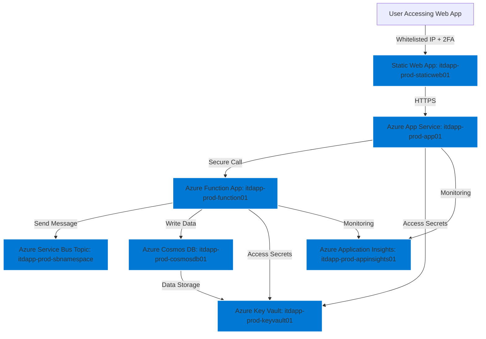
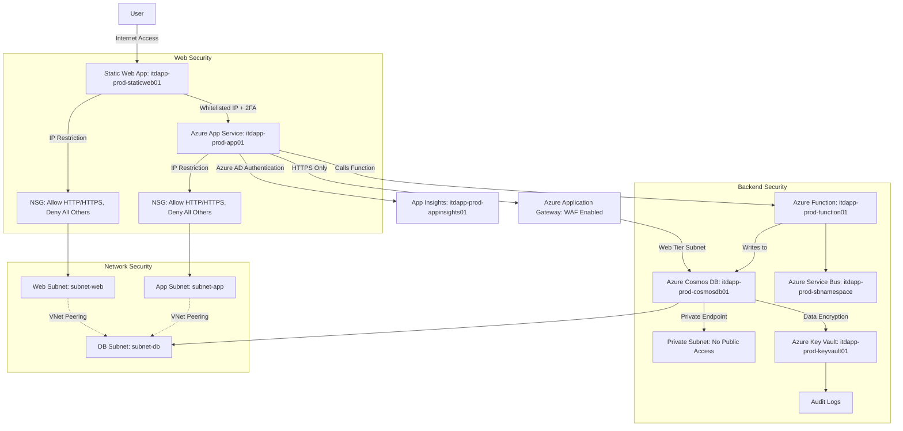

# Kickstart Azure Infrastructure Template

This repository contains an ARM template designed to kickstart a secure, scalable, and efficient infrastructure on Azure. The infrastructure includes a Static Web App, Azure App Service, Azure Function, Cosmos DB, Key Vault, Application Insights, and other essential components. This setup is designed with security, scalability, and monitoring in mind, making it an ideal starting point for production-grade applications.

## Features

- **Static Web App**: Serves static content with secure access through IP whitelisting and 2FA.
- **Azure App Service**: Hosts the main web application, secured with HTTPS only and Azure AD authentication.
- **Azure Function**: Handles backend processing with pay-as-you-go consumption plan, integrated with Service Bus and Cosmos DB.
- **Azure Cosmos DB**: Stores application data with session consistency and private endpoint access.
- **Azure Key Vault**: Manages secrets with secure access from the web app and function app.
- **Application Insights**: Provides monitoring and diagnostics for the App Service and Function App.
- **Network Security Groups (NSG)**: Applied to subnets for fine-grained access control.

## Infrastructure Diagram

### Overview Diagram




### Detailed Network and Security Diagram



### Detailed Explanation

#### 1. **Static Web App**
   - Serves static content, accessible only from whitelisted IP addresses and protected by 2FA.

#### 2. **Azure App Service**
   - Hosts the main web application. Secured with HTTPS and integrates with Azure AD for authentication.
   - Interacts with backend services like Azure Function and Cosmos DB.

#### 3. **Azure Function App**
   - Handles backend processing using a consumption plan. It processes messages from the Azure Service Bus and interacts with Cosmos DB for data storage.

#### 4. **Azure Cosmos DB**
   - Provides scalable, globally distributed database services with session consistency and secure access via private endpoints.

#### 5. **Azure Key Vault**
   - Manages sensitive information like connection strings and secrets, accessible only by the App Service and Function App.

#### 6. **Application Insights**
   - Integrated into both the Azure App Service and Azure Function App to provide real-time monitoring and diagnostics.

#### 7. **Network Security**
   - Network Security Groups (NSGs) are applied to control traffic at the subnet level, ensuring that only authorized traffic can access the resources.

## Getting Started

To deploy this template:

1. Clone this repository.
2. Customize the parameters in the ARM template if needed.
3. Deploy the template using Azure CLI, PowerShell, or the Azure Portal.

### Deployment Commands

Using Azure CLI:

```bash
az deployment group create --resource-group <your-resource-group> --template-file azuredeploy.json
```

Using PowerShell:
```bash
New-AzResourceGroupDeployment -ResourceGroupName <your-resource-group> -TemplateFile azuredeploy.json
```

### Contributing
If you'd like to contribute to this project, please submit a pull request or open an issue on GitHub.

### License
This project is licensed under the MIT License - see the LICENSE file for details.

